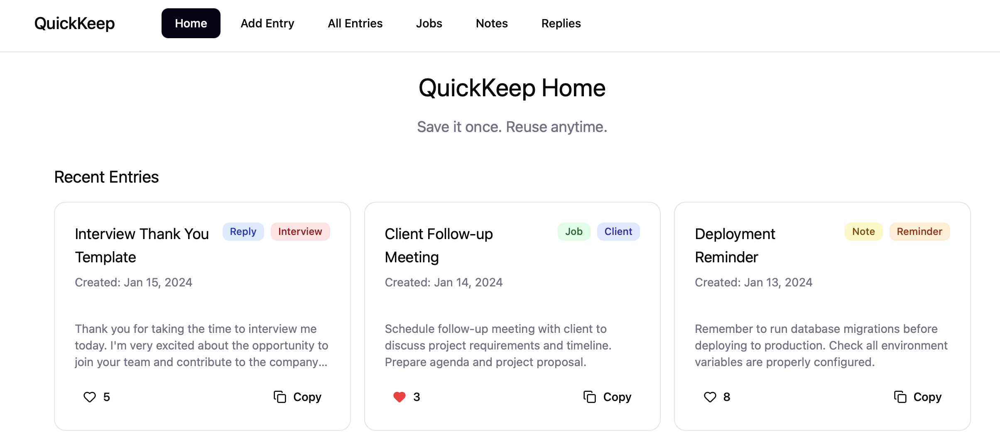
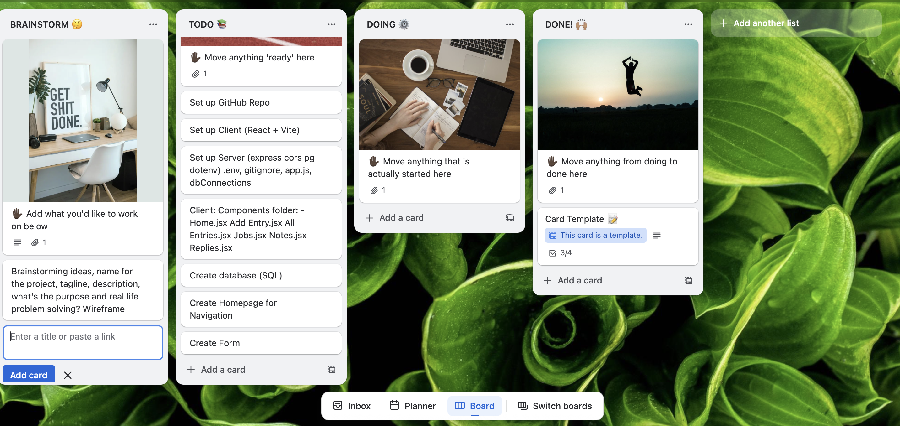
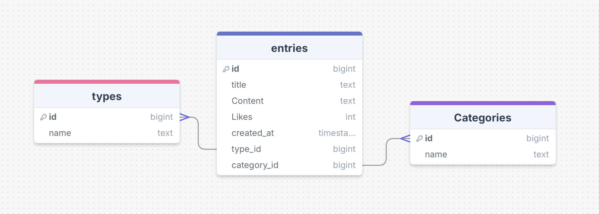
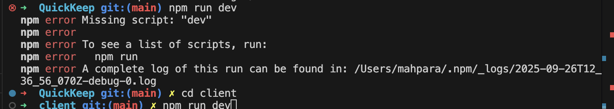

# QuickKeep - Save it fast. Find it faster. Keep your best bits at your fingertips. 🚀📚✨

---

## 📱💻 Responsive

**QuickKeep** is designed to be fully responsive, whether you're on a phone, tablet, or desktop. I used Tailwind CSS, reatc-icons, material UI. The UI flows nicely and the features stay accessible no matter the screen size.

---

## 💡 What It Is:
A super simple tool where users can save, organize, and retrieve reusable text snippets (like email replies, customer responses, message templates, FAQs, etc.).
Think of it like a mini personal text snippet bank — useful for freelancers, support reps, recruiters, students, etc. I started as a developer, then somehow became a brand ambassador and then i put the whole effort in  uniting two friends from the both ends.

---

## 🛠️ 🔥 Features
- Full-stack app using ReactJS, Vite, Express, PostgreSQL, and Tailwind CSS.
- Secure backend with environment variables.
- Clean and fast UI for quick data access.
- Error handling and not found page for smoother user experience.
- 📝 Add new entries with title, content, type (e.g., journal, job), and category (e.g., tech, random).
- Thunderclient
- React Icons
- 🔍 Search entries by title or content.
- 🧠 Filter by type and category using dropdowns or URL.
- ❤️ Like entries — because your past self deserves some love.
- 🗑 Delete entries you’ve outgrown.
- 📋 Copy content to clipboard with a click.

---

---
## Requirements

- 🎯 Create a client using React. ✅
- 🎯 Use Express to create your server, using both GET and POST endpoints. ✅
- 🎯 Build a React form for users to create posts. ✅
- 🎯 Create multiple pages using React Router. ✅
- 🎯 Design a database schema, and seed the database with some realistic data. ✅
- 🎯 Use SQL to retrieve posts from the database in your Express server. ✅
- 🎯 Display all posts using .map(). ✅
- 🎯 Use an interval and useEffect() to poll your database. ✅

---

## Stretch Requirements

- 🏹 Create dynamic pages using react-router-dom. ✅
- 🏹 Use react-router-dom to create a dedicated route for the categories ✅
- For example, /posts/:categoryName. ✅
- 🏹 Allow users to delete posts. ✅
- 🏹 Add ‘like’ functionality on posts. ✅
- 🏹 Create additional SQL queries to show filtered posts. ✅

---

## 🛠️🗂️ Planning

I started with rough ideas about CRUD operations and filters. Initially everything was working as planned then error decided the twist in the plan. I deployed server first then client and did not make me happy because I wanted QuickKeep in the client and tried to change it, sometimes perfection is not good.

---

## WireFrame

---

## Trello

---

## DrawSql

---

## LightHouse

---

## First Shock

---

## 🧪 Error Handling & Lessons Learned

This project was a wild ride full of trial and error — and a lot of learning:
- Git struggles: I ran into errors like src refspec main does not match any and remote origin already exists. Turns out, I had to carefully git add, commit, and fix my remote origin confusion before pushing.
- NPM script gotchas: Spent way too much time running npm run dev in the wrong folder before realizing it had to be run separately in both client and server folders.
- SQL debugging: Messed up update queries with wrong placeholders — took a while digging through notes and trial and error to get it right. I had SQL table categories already in the tables and I created another one so I got all the entries in Categories that already existed so I deleted it and when I deleted it I lost the foreign key. After Googling and videos I found how to join them and finally it worked.
- Environment variables: Struggled to make .env files work, especially on the client side with import.meta.env.VITE_SERVER_BASE_URL. Realized after a lot of googling and re-checking past projects that the VITE_ prefix was mandatory for client env variables.
- Routing clarity: Simplified routes from /entries/:type to /entries/type/:type for better understanding and filtering.
- Date/time issues: Fixed “invalid date” bugs by installing and using a React time formatting package.
- Deployment headaches: Accidentally pushed wrong .env file to Render, causing endless “application process” errors — panicked, but after clearing cache and redeploying, it all worked.
- Google to the rescue: I’ve asked Google millions of questions by now — if Google were a person, it’d probably have blocked me or handed me a coffee by this point. Without it (and YouTube tutorials), I’d still be stuck in debugging limbo forever.
- Fetching data: Realized I was trying to get data directly in the EntryCard component without properly fetching it from the server first — rookie mistake!
- I got all the errors from 🚨 500 to 404 to 400, mismatched id. I tried to fixed them through google console and networking tab and preview then so many trial and errors. Sometimes entries were not fetching, sometimes types and categories.
- I thought I have installed react router and was getting error, showed my codes to Bertie and everything looked good, thanks for his advice,  I checked and found I did not install it and after installing it resolved the issue.
- Created Jobs.js Notes.jsx, Replies.jsx but due to lack of time and so many trials and errors decided to delete it. 
- I experimented with environment variables, I added my backend (server's) URL in .env.production to hide it and it didn't work. I made millions of changes in the code but eventually found the problem. When I added my URL in the code everything started working.

---

## 🙏 Credits
- Huge thanks to my instructors and classmates for the notes and workshop support.
- The React, Tailwind CSS, and PostgreSQL communities for great docs and examples.
- Google, Youtube and StackOverflow for saving me countless times.

---

## 🙌 Final Thoughts 
QuickKeep is more than just code; it’s a story of perseverance, mistakes, and growth. Every error was frustrating but rewarding in the end. This project taught me how to debug better, plan smarter, and stay calm when nothing seems to work. I’m proud of how far it’s come and excited to keep improving it with better features and polish.
"After some awkward handshakes and a few 500 errors, frontend and backend are now talking like besties!"
Mistakes happen. **That’s how we get better**. 💪 **“You don’t learn to code by writing code. You learn by fixing broken code.”**

## 📘 Resources

- [Design Methodologies](https://mui.com/material-ui/getting-started/installation/)
- [NPM Package](https://www.npmjs.com/package/react-time)
- [Format Date](https://youtu.be/bzMylJVjWu8)
- [Array Method](https://youtu.be/ZHsPVhkTUDg)
- [Updating arrays in state](https://react.dev/learn/updating-arrays-in-state#removing-from-an-array)
- [Fetch Methods](https://developer.mozilla.org/en-US/docs/Web/API/Fetch_API/Using_Fetch)
- [String to lower case](https://developer.mozilla.org/en-US/docs/Web/JavaScript/Reference/Global_Objects/String/toLowerCase)
- [Character Limit](https://youtu.be/4SstGzs82iM)

**MDN, React Docs, I paraphrased using AI and I added commands in the planning. I edited and added emoji's for final touch**